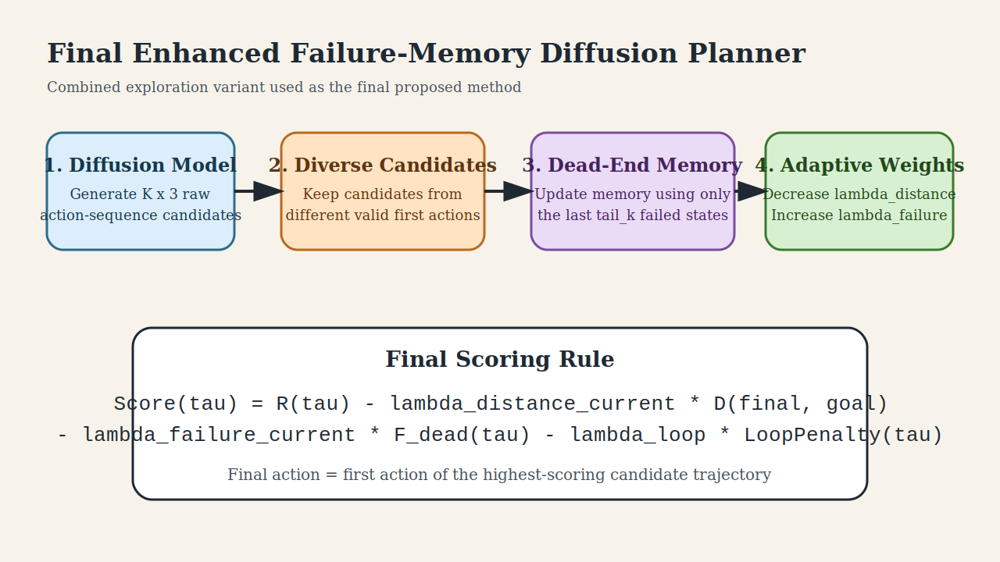
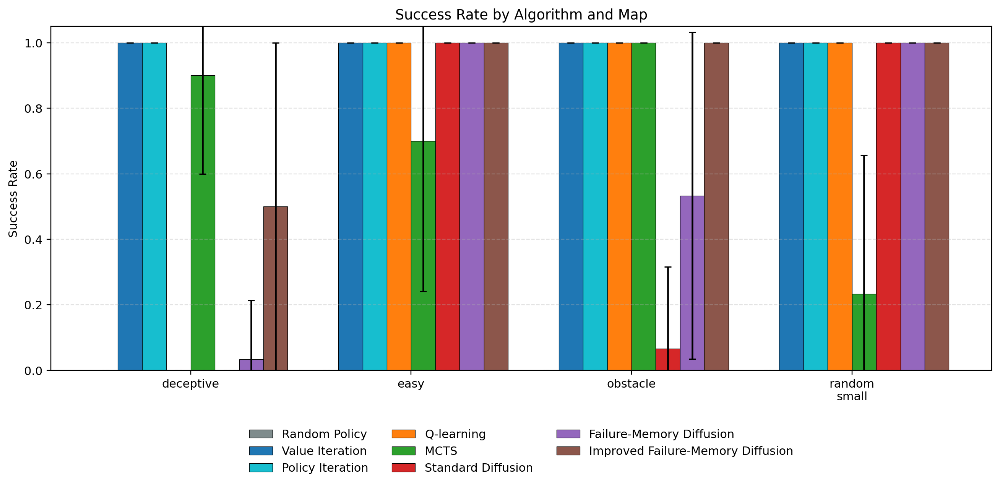
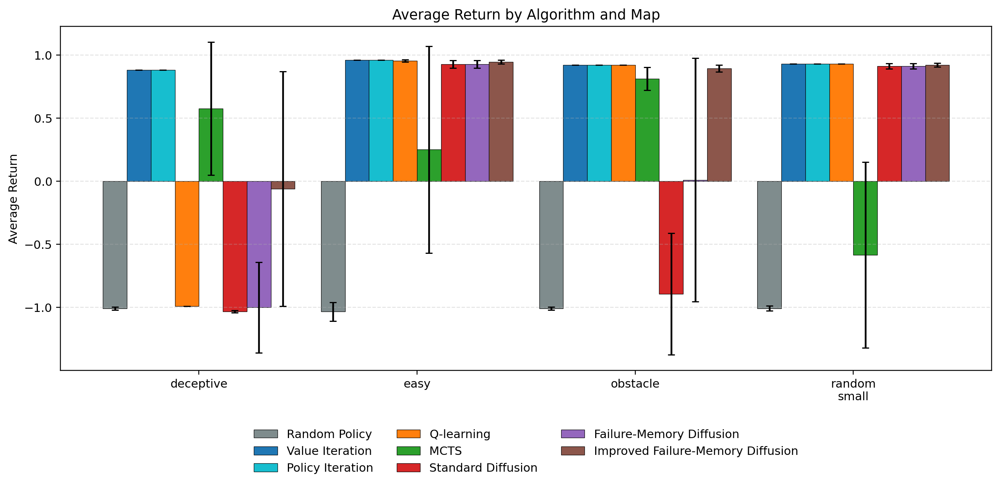
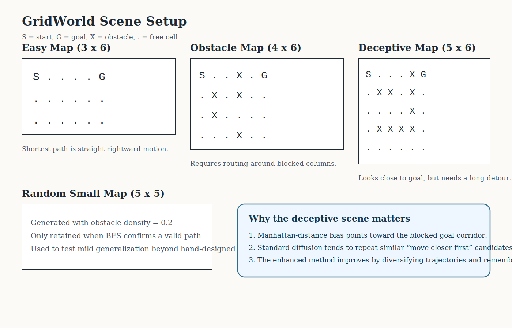
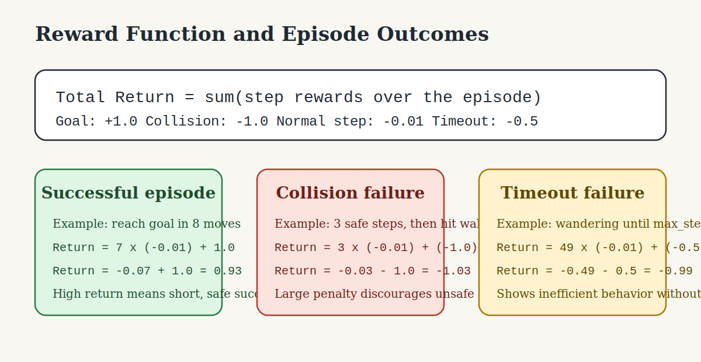

# Failure-Memory Guided Diffusion Planning for Grid-World Reinforcement Learning

This project studies diffusion-based planning in a deterministic GridWorld and proposes a final enhanced method:

**Improved Failure-Memory Diffusion**, implemented as the **Combined Exploration Failure-Memory Planner**.

The final method keeps the original failure-memory idea but improves it with:

- tail-only failure-memory updates,
- diverse trajectory candidate selection,
- adaptive failure-aware weighting,
- and a loop penalty.

The final benchmark in this repository compares that enhanced method against:

- Random Policy
- Value Iteration
- Policy Iteration
- Q-learning
- Monte Carlo Tree Search (MCTS)
- Standard Diffusion
- Failure-Memory Diffusion
- Improved Failure-Memory Diffusion

## Final Proposed Method



The final method is the planner named `Improved Failure-Memory Diffusion`, based on [Exploration/combined_exploration_planner.py](Exploration/combined_exploration_planner.py).

Its fixed settings in the final benchmark are:

- `lambda_failure = 0.5`
- `K = 40`
- `lambda_distance_base = 0.1`
- `tail_k = 5`
- `lambda_loop = 0.2`

## Overall Comparison First

The main benchmark output is:

- [Exploration/benchmark_results/tables/improved_benchmark_comparison.csv](Exploration/benchmark_results/tables/improved_benchmark_comparison.csv)
- [Exploration/benchmark_results/tables/improved_benchmark_comparison_per_seed.csv](Exploration/benchmark_results/tables/improved_benchmark_comparison_per_seed.csv)

The main figures are:

- [Exploration/benchmark_results/figures/success_rate_comparison.png](Exploration/benchmark_results/figures/success_rate_comparison.png)
- [Exploration/benchmark_results/figures/average_return_comparison.png](Exploration/benchmark_results/figures/average_return_comparison.png)
- [Exploration/benchmark_results/figures/collision_rate_comparison.png](Exploration/benchmark_results/figures/collision_rate_comparison.png)
- [Exploration/benchmark_results/figures/inference_time_comparison.png](Exploration/benchmark_results/figures/inference_time_comparison.png)





The refreshed benchmark uses `10` random seeds and `10` evaluation episodes per seed. Summary values below are reported as mean `+-` standard deviation across seed means.

### Headline Result

Among the diffusion-family methods:

- **Standard Diffusion** is the weakest on hard maps.
- **Failure-Memory Diffusion** improves safety and success on obstacle-heavy maps.
- **Improved Failure-Memory Diffusion** is the strongest diffusion-based method in this repository, especially on deceptive and obstacle maps.

### Key Benchmark Interpretation

- On the **deceptive** map:
  - Standard Diffusion: success `0.000 +- 0.000`, collision `1.000 +- 0.000`
  - Failure-Memory Diffusion: success `0.020 +- 0.042`, collision `0.970 +- 0.048`
  - Improved Failure-Memory Diffusion: success `0.500 +- 0.189`, collision `0.000 +- 0.000`
  - MCTS: success `0.890 +- 0.088`
  - Value Iteration / Policy Iteration: success `1.000 +- 0.000`

- On the **obstacle** map:
  - Standard Diffusion: success `0.030 +- 0.048`, collision `0.970 +- 0.048`
  - Failure-Memory Diffusion: success `0.510 +- 0.088`, collision `0.490 +- 0.088`
  - Improved Failure-Memory Diffusion: success `1.000 +- 0.000`, collision `0.000 +- 0.000`
  - MCTS: success `0.990 +- 0.032`
  - Value Iteration / Policy Iteration / Q-learning: success `1.000 +- 0.000`

- On the **easy** and **random_small** maps:
  - all strong planners eventually succeed,
  - but the improved planner gets better return and shorter successful paths than the two earlier diffusion planners.

### Honest Conclusion

The improved diffusion planner does **not** beat oracle planners such as Value Iteration and Policy Iteration on a small known GridWorld. That is expected. The contribution of the project is instead:

- improving **diffusion planning** itself,
- showing that **failure-aware trajectory guidance** helps,
- and showing that **combined exploration mechanisms** make diffusion planning much more robust on deceptive maps.

## Environment Setup

The environment is a deterministic GridWorld implemented in [envs/gridworld.py](envs/gridworld.py).

- State: `(row, col)`
- Actions:
  - `0 = up`
  - `1 = down`
  - `2 = left`
  - `3 = right`
- Observation: full agent position
- Dynamics: deterministic
- Obstacles: fixed blocked cells
- Termination:
  - reach goal,
  - collide with wall/obstacle,
  - or hit `max_steps`

## Scene Setup for Each Map



### 1. Easy Map

- Size: `3 x 6`
- Start: top-left
- Goal: top-right
- Obstacles: none
- Purpose:
  - sanity-check map,
  - tests whether planners can exploit a direct route.

Expected behavior:

- oracle methods should be optimal,
- Q-learning should learn quickly,
- diffusion planners should succeed if they generate goal-directed sequences.

### 2. Obstacle Map

- Size: `4 x 6`
- Start: top-left
- Goal: top-right
- Obstacles create vertical barriers and narrow detours.
- Purpose:
  - tests obstacle avoidance,
  - checks whether failure memory reduces repeated unsafe collisions.

Expected behavior:

- weak planners collide repeatedly,
- stronger planners route around blocked columns.

### 3. Deceptive Map

- Size: `5 x 6`
- Start: top-left
- Goal: top-right
- Obstacles create a visually attractive but blocked corridor near the goal.
- Purpose:
  - main stress test for the project,
  - tests whether planners can avoid “move closer first” mistakes,
  - tests whether memory and candidate diversity help discover the long detour.

Expected behavior:

- Manhattan-style distance bias is misleading,
- repeated failures happen near the dead-end corridor,
- enhanced diffusion should outperform standard diffusion here.

### 4. Random Small Map

- Size: `5 x 5`
- Start: `(0, 0)`
- Goal: `(4, 4)`
- Obstacle density: `0.2`
- Constraint:
  - map is kept only if BFS confirms a valid path.
- Purpose:
  - tests mild generalization beyond hand-designed scenes.

## Reward Function



The reward design is intentionally simple:

- Goal reached: `+1.0`
- Collision with wall or obstacle: `-1.0`
- Normal step: `-0.01`
- Timeout at `max_steps`: `-0.5`

### Reward Calculation Examples

Example 1: successful path in 8 actions

- `7` normal steps and then `1` goal step
- Return = `7 * (-0.01) + 1.0`
- Return = `-0.07 + 1.0 = 0.93`

Example 2: collision after 3 safe steps

- Return = `3 * (-0.01) + (-1.0)`
- Return = `-0.03 - 1.0 = -1.03`

Example 3: timeout after 50-step limit

- Return = `49 * (-0.01) + (-0.5)`
- Return = `-0.49 - 0.5 = -0.99`

### Interpretation

- Short successful paths have the highest return.
- Unsafe trajectories are strongly penalized.
- Wandering without collision is still bad because the timeout penalty plus step cost becomes negative.

## Metrics and What They Mean

- **Success Rate**: fraction of episodes reaching the goal.
- **Average Return**: total episode reward.
- **Path Length**: number of actions taken before termination.
- **Collision Rate**: fraction of episodes ending by collision.
- **Optimality Gap**: successful path length minus BFS shortest-path length.
- **Repeated Failure Rate**: how often the planner revisits states already associated with failure.
- **Inference Time Mean**: average action-selection time.

Interpretation:

- high success and high return are good,
- low collision is good,
- low optimality gap means efficient successful paths,
- low repeated failure means memory is helping,
- low inference time means cheaper online planning.

## Algorithms Used

### Random Policy

- picks actions uniformly at random.
- Purpose: weak baseline.

### Value Iteration

- model-based oracle baseline.
- uses exact transition dynamics.

### Policy Iteration

- model-based oracle baseline.
- also uses exact transition dynamics.

### Q-learning

- tabular model-free baseline.
- learns state-action values from interaction.

### MCTS

- online search baseline.
- uses repeated simulation and UCB selection.

### Standard Diffusion

- generates action-sequence candidates with the diffusion model,
- scores them by reward and goal-distance penalty,
- executes the first action of the best candidate.

### Failure-Memory Diffusion

- same diffusion generation,
- adds a penalty for trajectories that pass through failure-associated states.

### Improved Failure-Memory Diffusion

- final proposed method,
- combines:
  - dead-end memory,
  - candidate diversity,
  - adaptive weighting,
  - loop penalty.

## Why the Final Method Was Chosen

The exploration study is stored in:

- [Exploration/results/tables/exploration_comparison.csv](Exploration/results/tables/exploration_comparison.csv)

And the main exploration plots are:

- [Exploration/results/figures/exploration_success_rate.png](Exploration/results/figures/exploration_success_rate.png)
- [Exploration/results/figures/exploration_average_return.png](Exploration/results/figures/exploration_average_return.png)
- [Exploration/results/figures/exploration_collision_rate.png](Exploration/results/figures/exploration_collision_rate.png)


From that exploration:

- **Dead-End Memory** alone gave little improvement.
- **Adaptive Failure** helped moderately.
- **Diverse Candidates** was strong on obstacle maps.
- **Combined Exploration** was the most effective overall, especially on deceptive maps.

This is why the final report should treat **Improved Failure-Memory Diffusion** as the main method.

## Clear Failure Examples by Algorithm

### Random Policy failure

Typical failure:

- moves into a wall or obstacle almost immediately,
- gets return close to `-1.0`,
- collision rate is extremely high.

Example interpretation:

- On the obstacle and deceptive maps, Random Policy often crashes within the first few moves because it has no planning signal.

### Q-learning failure

Typical failure:

- can get stuck wandering if training is insufficient,
- may fail completely on deceptive maps because the long detour is hard to learn from sparse rewards.

Example interpretation:

- In the deceptive map benchmark, Q-learning had success `0.100 +- 0.316`, showing that local trial-and-error learning only occasionally discovered the correct route under the current budget.

### Standard Diffusion failure

Typical failure:

- generates many similar “move toward goal first” trajectories,
- gets trapped by deceptive map geometry,
- collides near blocked corridors.

Example interpretation:

- On the deceptive map, Standard Diffusion had success `0.000 +- 0.000` and collision `1.000 +- 0.000`, meaning its goal-distance-biased sampling was not enough to escape the misleading corridor.

### Failure-Memory Diffusion failure

Typical failure:

- does better than Standard Diffusion on obstacle maps,
- but can still over-penalize large parts of a failed trajectory,
- which may suppress useful early states along the only correct detour.

Example interpretation:

- In the deceptive map, the original failure-memory method still failed almost always because whole-trajectory memory polluted states that were not truly bad.

### MCTS failure

Typical failure:

- when simulation budget is too small, search quality drops,
- may still find long, inefficient successful routes.

Example interpretation:

- On the deceptive map, MCTS succeeded often, but with a large optimality gap because it found workable but inefficient detours.

### Improved Failure-Memory Diffusion failure

Typical failure mode:

- still slower than all tabular methods and MCTS,
- can produce long successful paths,
- does not match oracle optimality on simple maps.

Example interpretation:

- On the deceptive map, the improved method reaches `0.500 +- 0.189` success with zero collision, which is a big safety improvement, but it is still not as strong as MCTS or oracle planning.

## Why the Improved Method Helps

The final method improves the earlier failure-memory planner in three important ways:

1. **Dead-end memory**
- only the last few failed states are marked,
- avoids wrongly penalizing useful early parts of a detour.

2. **Diverse candidates**
- forces the planner to consider trajectories with different first actions,
- important when the correct move initially goes away from the goal.

3. **Adaptive failure weighting**
- after repeated failures, the planner trusts distance-to-goal less,
- and trusts failure memory more.

4. **Loop penalty**
- discourages oscillation and cyclic trajectories.

Together these changes explain why the enhanced method improves most strongly on deceptive and obstacle-heavy scenes.

## Final Interpretation of Results

### Strengths

- strongest diffusion-based planner in the repository,
- large improvement over Standard Diffusion,
- large improvement over original Failure-Memory Diffusion on deceptive and obstacle maps,
- much safer on deceptive maps than earlier diffusion variants.

### Weaknesses

- slower than MCTS and much slower than tabular methods,
- still below oracle planners in a small known environment,
- may succeed with long detours rather than near-optimal paths.

### What the project demonstrates

This project does **not** claim that diffusion planning is the best method for small deterministic GridWorlds.

Instead, it demonstrates that:

- diffusion planning can be improved significantly,
- failure-aware guidance is useful,
- and combining memory, diversity, and adaptive control makes diffusion planning more robust in deceptive scenes.

## File Guide

- Main environment: [envs/gridworld.py](envs/gridworld.py)
- Standard diffusion planner: [planners/diffusion_planner.py](planners/diffusion_planner.py)
- Original failure-memory planner: [planners/failure_memory_planner.py](planners/failure_memory_planner.py)
- Final proposed method: [Exploration/combined_exploration_planner.py](Exploration/combined_exploration_planner.py)
- Final benchmark table: [Exploration/benchmark_results/tables/improved_benchmark_comparison.csv](Exploration/benchmark_results/tables/improved_benchmark_comparison.csv)

## How To Run

Install:

```bash
pip install -r requirements.txt
```

Main project comparison:

```bash
python3 main.py
```

Final enhanced benchmark:

```bash
python3 Exploration/run_improved_benchmark.py
```

Exploration ablation:

```bash
python3 Exploration/run_exploration_comparison.py
```
