# Improving Diffusion-Based GridWorld Planning with Online Failure Memory

## Package Layout
- `REPORT.md`: revised report with updated statistics, clearer claims, and figure notes.
- `figures/`: curated figure set copied from the refreshed experiment outputs.

## Abstract
This revised report studies diffusion-based planning in a deterministic GridWorld and focuses on a more defensible evaluation protocol than the earlier draft. The diffusion model is trained on BFS shortest-path demonstrations and then used online to propose candidate trajectories. The main research question is whether online failure memory can improve candidate ranking without retraining the generator.

The key methodological upgrades in this version are: seed-level reporting, 95% confidence intervals over seed means in the figures, numeric parameter sweeps for `lambda_F` and `K`, and a new remove-one-component ablation for the final planner. Under the refreshed benchmark, Improved Failure-Memory Diffusion reached `success = 1.000 +- 0.000` with zero collision on the obstacle map and `success = 0.500 +- 0.189` with zero collision on the deceptive map. The deceptive-map gain over the original failure-memory planner appeared in 9 of 10 seeds.

## What Changed Relative to the Earlier Draft
1. All main reported metrics are now aggregated per seed first and summarized as `mean +- SD` across the 10 seed means.
2. Main comparison and ablation figures now show 95% confidence intervals over seed means.
3. The qualitative candidate-budget summary was replaced with a numeric `K` sweep.
4. The `lambda_F` tuning discussion is now tied to an explicit sweep table and figure.
5. A new remove-one-component ablation was added for the final planner.
6. Reproducibility details are collected in one implementation table.
7. The report framing now separates oracle/reference baselines from approximate and learned planners.

## Problem Setup and Fairness Framing
The task is a deterministic, fully observable GridWorld with four actions, fixed start and goal states, collision termination, and a 50-step limit. The comparison mixes methods with different assumptions, so the baselines should be interpreted in two tiers:

- `Value Iteration` and `Policy Iteration` are reference baselines with full transition knowledge.
- `Q-learning`, `MCTS`, and the diffusion-family planners are approximate methods with different training and inference budgets.

This report does not claim that the diffusion planner is more general or cheaper than all baselines. The narrower goal is to show whether online failure-aware ranking improves the diffusion-family planner under the same learned generator.

## Related Work and Research Gap
Diffusion planners such as Diffuser, Decision Diffuser, and later action-diffusion policies show that generative trajectory models can represent multimodal action sequences. However, these methods typically guide trajectories through rewards, task constraints, or learned value estimates. They do not usually maintain an explicit online spatial memory of repeated evaluation failures during execution.

The research gap for this project is therefore narrower than general reinforcement learning: can online failure memory change candidate ranking enough to improve a fixed diffusion generator without retraining it after each failed episode?

## Research Questions
This report is framed as a controlled study of diffusion-planner behavior in deterministic GridWorld navigation rather than only as a leaderboard comparison. The evaluation is organized around four research questions:

1. How does a diffusion-based planner behave in small deterministic GridWorlds when it is trained on BFS shortest-path demonstrations?
2. Can online failure memory improve the robustness of a fixed diffusion planner on obstacle-heavy and deceptive maps without retraining the generator?
3. Which components of the final planner, tail-focused memory, adaptive weighting, candidate diversity, and loop penalty, contribute most to the observed improvement?
4. How do the candidate budget `K` and the failure-memory coefficient `lambda_F` affect the trade-off between success, safety, and inference cost?

The benchmark section answers Research Questions 1 and 2, the exploration and remove-one ablations answer Research Question 3, and the parameter sweeps answer Research Question 4.

## Method Summary
The final planner combines four mechanisms:
1. Tail-only failure-memory updates.
2. Adaptive distance and failure penalties based on recent failures.
3. First-action diversity through oversampling and regrouping.
4. A repeated-state loop penalty.

The earlier large box-diagram figures were not reused in this package because they did not scale reliably for double-column layout. Instead, the package keeps a smaller conceptual comparison figure and adds clearer notes next to the empirical plots.

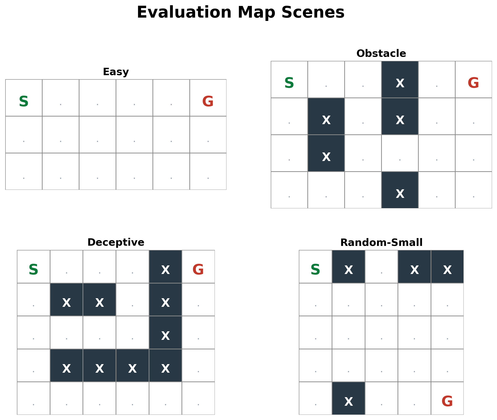

*Figure note.* The benchmark uses four maps: an easy open map, an obstacle map, a deceptive corridor map, and one random small map. The deceptive map is the main stress test because the shortest successful route initially moves away from the goal.

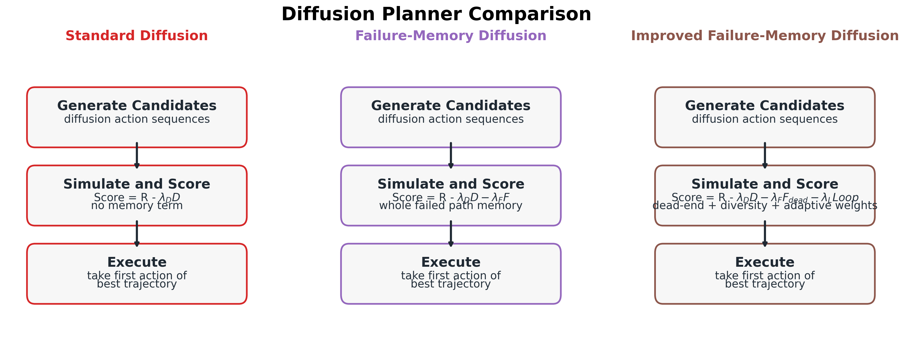

*Figure note.* The three diffusion-family planners share the same generator but differ in candidate scoring and memory handling. This makes the family comparison more meaningful than comparing raw success rates against exact planners alone.

## Reproducibility and Implementation Details
| Component | Setting |
| --- | --- |
| Environment | Deterministic GridWorld with 4 actions, max_steps = 50 |
| Rewards | goal = +1.0, collision = -1.0, move = -0.01, timeout = -0.5 |
| Diffusion input | 12-step horizon, 4-way one-hot action encoding, 48-dim flattened trajectory |
| Condition vector | [row, col, goal_row, goal_col] normalized by grid size |
| Network | Conditional MLP: 48+4+64 -> 128 -> 128 -> 48 |
| Activations | ReLU |
| Time embedding | 64-dim sinusoidal embedding |
| Optimizer | Adam, learning rate = 1e-3 |
| Batch size | 32 in all rerun experiments |
| Noise schedule | Linear beta schedule from 1e-4 to 0.02 over 25 diffusion steps |
| Training data | BFS shortest paths from every reachable traversable start state on each map |
| Padding rule | Sequences shorter than the horizon repeat the final action |
| Retraining policy | One diffusion model retrained for each seed and each map |
| Standard diffusion | lambda_D = 0.1, K selected from {5, 10, 20, 30, 40} |
| Failure-memory diffusion | lambda_F sweep over {0.0, 0.1, 0.5, 1.0, 2.0, 5.0}; K sweep over {5, 10, 20, 30, 40} |
| Improved planner | tail_k = 5, raw_multiplier = 3, lambda_loop = 0.2 |
| Adaptive weights | lambda_D(t) = lambda_D,0 / (1 + alpha * F_recent), lambda_F(t) = lambda_F,0 * (1 + beta * F_recent) |
| Adaptive parameters | lambda_D,0 = 0.1, lambda_F,0 = 0.5, alpha = 0.5, beta = 0.5, window W = 10 |
| Q-learning | alpha = 0.1, gamma = 0.99, epsilon = 1.0 -> 0.05 with decay 0.995, 400 training episodes |
| MCTS | 25 simulations/action, UCB exploration constant 1.41, heuristic rollout enabled, rollout depth 30 |
| Value/Policy Iteration | gamma = 0.99, convergence threshold theta = 1e-6 |
| Timing hardware | Apple M4 MacBook Air, 10-core CPU, 16 GB RAM, torch 2.9.0 CPU-only |

## Evaluation Protocol and Statistical Reporting
- Seeds: `0, 1, 2, 3, 4, 5, 6, 7, 8, 9`
- Evaluation episodes per seed: `10`
- Main benchmark total per algorithm-map combination: `100` episodes
- Reported tables: seed means summarized as `mean +- SD`
- Figures: error bars show 95% confidence intervals over the 10 seed means
- Even with 10 seeds, the report emphasizes uncertainty and effect direction rather than overstating significance

Raw, per-seed, and summary CSV files were regenerated for the benchmark, exploration study, `lambda_F` sweep, `K` sweep, and component ablation. These refreshed outputs now live in:
- `Exploration/benchmark_results/tables/`
- `Exploration/results/tables/`
- `Exploration/component_ablation_results/tables/`
- `results/tables/`

## Main Benchmark
The strongest evidence for the improved planner comes from the two difficult maps:

| Planner | Map | Success Rate | Collision Rate | Average Return |
| --- | --- | --- | --- | --- |
| Failure-Memory Diffusion | deceptive | 0.020 +- 0.042 | 0.970 +- 0.048 | -1.020 +- 0.076 |
| Improved Failure-Memory Diffusion | deceptive | 0.500 +- 0.189 | 0.000 +- 0.000 | -0.065 +- 0.349 |
| Standard Diffusion | deceptive | 0.000 +- 0.000 | 1.000 +- 0.000 | -1.032 +- 0.003 |
| Failure-Memory Diffusion | obstacle | 0.510 +- 0.088 | 0.490 +- 0.088 | -0.035 +- 0.170 |
| Improved Failure-Memory Diffusion | obstacle | 1.000 +- 0.000 | 0.000 +- 0.000 | 0.883 +- 0.012 |
| Standard Diffusion | obstacle | 0.030 +- 0.048 | 0.970 +- 0.048 | -0.965 +- 0.094 |

The deceptive-map improvement is not a single pooled proportion hiding seed instability. The per-seed summary below shows that the improved planner matched or exceeded the original failure-memory planner in all 10 seeds, with strict improvement in 9 of 10:

| Planner | Per-seed success values | Success Mean +- SD | Collision Mean +- SD | Repeat Mean +- SD |
| --- | --- | --- | --- | --- |
| Failure-Memory Diffusion | s0=0.100, s1=0.000, s2=0.000, s3=0.000, s4=0.000, s5=0.000, s6=0.100, s7=0.000, s8=0.000, s9=0.000 | 0.020 +- 0.042 | 0.970 +- 0.048 | 0.734 +- 0.053 |
| Improved Failure-Memory Diffusion | s0=0.500, s1=0.600, s2=0.400, s3=0.600, s4=0.000, s5=0.500, s6=0.600, s7=0.600, s8=0.600, s9=0.600 | 0.500 +- 0.189 | 0.000 +- 0.000 | 0.194 +- 0.071 |

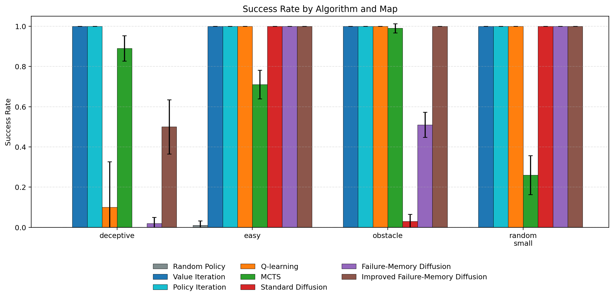

*Figure note.* Error bars show 95% confidence intervals over seed means. `Value Iteration` and `Policy Iteration` should be read as reference ceilings rather than budget-matched competitors.

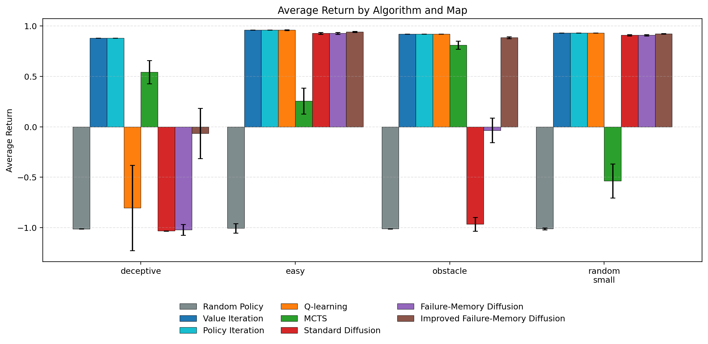

*Figure note.* The deceptive map remains difficult even when success improves, which is why average return remains below zero for the diffusion-family planners on that map.

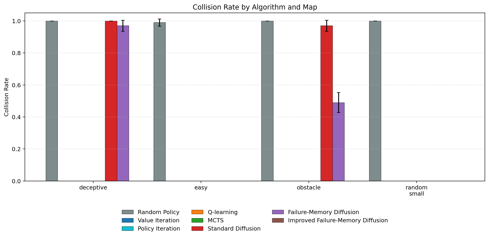

*Figure note.* The main robustness gain from the improved planner is collision suppression: on both obstacle and deceptive maps, collision dropped to zero across all 10 seeds.

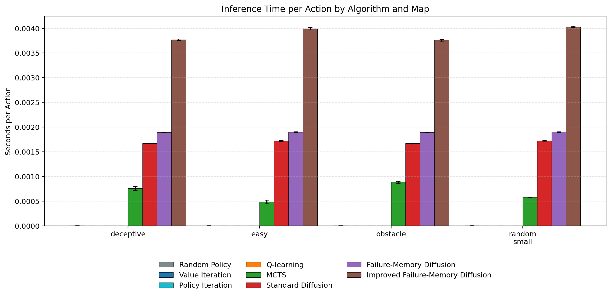

*Figure note.* Timing was measured as mean action-selection time on a CPU-only Apple M4 laptop. The improved planner is more expensive than the standard and original failure-memory variants because it oversamples and re-ranks more trajectories.

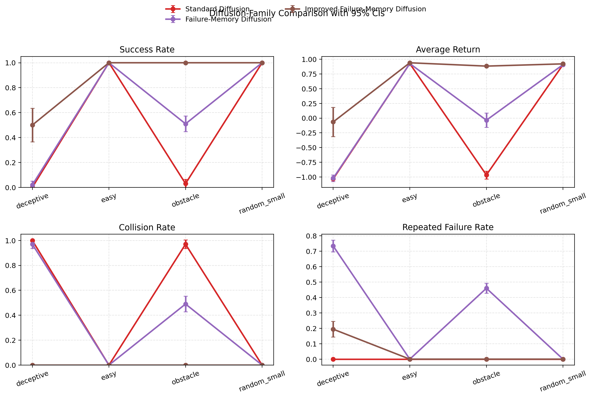

*Figure note.* This plot isolates the diffusion-family planners and makes the uncertainty easier to inspect than in the all-algorithm figure.

### Main Benchmark Interpretation
The revised benchmark supports three careful conclusions:

1. The improved planner clearly dominates the original failure-memory planner on the deceptive map. Its success rate increased from `0.020 +- 0.042` to `0.500 +- 0.189`, and collision fell from `0.970 +- 0.048` to zero.
2. The obstacle map result is even stronger: the improved planner reached perfect success with zero collision across all seeds.
3. Exact planners still outperform the diffusion-family methods on path efficiency and computational cost, so the contribution is best framed as a within-family improvement rather than a universal planner replacement.

## Exploration Study
The earlier exploration study remains useful because it separates the larger design ideas before the final combined method:

| Variant | Success Rate | Collision Rate | Average Return | Repeated Failure Rate |
| --- | --- | --- | --- | --- |
| Adaptive Failure | 0.250 +- 0.085 | 0.750 +- 0.085 | -0.555 +- 0.162 | 0.548 +- 0.058 |
| Combined Exploration | 0.500 +- 0.189 | 0.000 +- 0.000 | -0.065 +- 0.349 | 0.194 +- 0.071 |
| Dead-End Memory | 0.010 +- 0.032 | 0.970 +- 0.048 | -1.059 +- 0.071 | 0.720 +- 0.026 |
| Diverse Candidates | 0.090 +- 0.074 | 0.000 +- 0.000 | -0.832 +- 0.132 | 0.775 +- 0.043 |
| Failure-Memory Baseline | 0.020 +- 0.042 | 0.970 +- 0.048 | -1.020 +- 0.076 | 0.734 +- 0.053 |

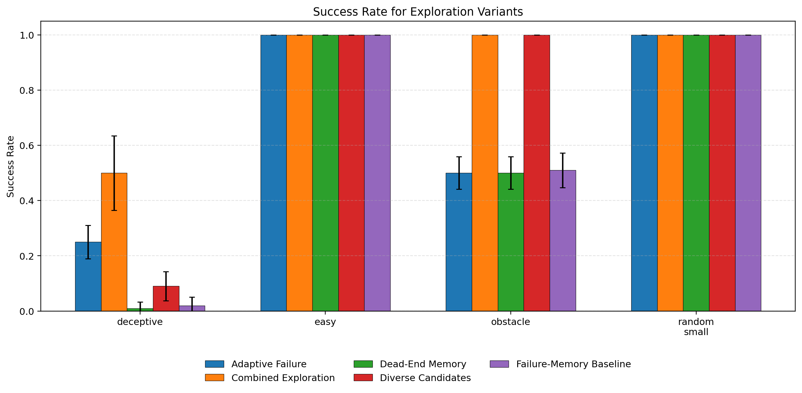

*Figure note.* The deceptive map is the main differentiator. The `Combined Exploration` planner achieved the best trade-off among the pre-final variants, while `Adaptive Failure` was the only single enhancement that substantially improved success on its own.

### Exploration Interpretation
The deceptive-map exploration table shows that adaptive weighting was the most important single ingredient before the final combination. Diversity alone removed collisions but did not produce a large success gain, while dead-end memory alone remained close to the original baseline.

## Remove-One Component Ablation
The refreshed report now includes the ablation that was missing in the earlier draft:

| Variant | Success Rate | Collision Rate | Average Return | Repeated Failure Rate |
| --- | --- | --- | --- | --- |
| Full Method | 0.490 +- 0.185 | 0.000 +- 0.000 | -0.081 +- 0.343 | 0.197 +- 0.069 |
| Without Adaptive Weights | 0.000 +- 0.000 | 0.000 +- 0.000 | -0.990 +- 0.000 | 0.678 +- 0.034 |
| Without Diversity | 0.480 +- 0.181 | 0.000 +- 0.000 | -0.098 +- 0.337 | 0.200 +- 0.090 |
| Without Loop Penalty | 0.490 +- 0.185 | 0.000 +- 0.000 | -0.081 +- 0.344 | 0.190 +- 0.073 |
| Without Tail Memory | 0.660 +- 0.052 | 0.000 +- 0.000 | 0.194 +- 0.077 | 0.448 +- 0.109 |

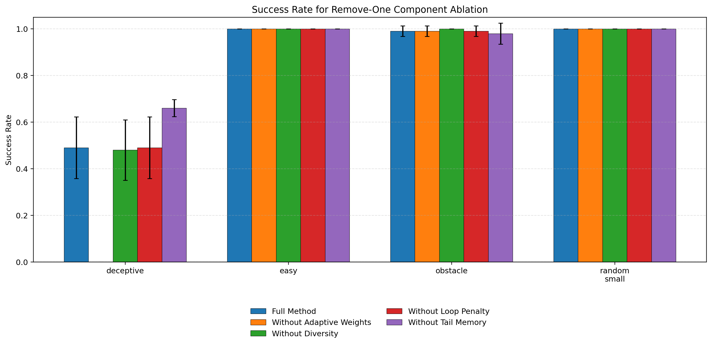

*Figure note.* This figure compares the full planner against variants where exactly one component is removed. Error bars again show 95% confidence intervals over seed means.

### Component Interpretation
This ablation changes the earlier story in an important way:

1. Removing adaptive weights caused the deceptive-map success rate to collapse from `0.500 +- 0.189` to `0.000 +- 0.000`. Adaptive weighting is therefore the most critical component in the final planner.
2. Removing diversity or the loop penalty had little effect under the current budget on the deceptive map. These mechanisms may still help stability, but this rerun does not justify strong claims that they are individually decisive.
3. Removing tail-only memory unexpectedly increased deceptive-map success to `0.660 +- 0.052` while also increasing the repeated-failure rate from `0.194 +- 0.071` to `0.448 +- 0.109`. The revised report should therefore present tail-only memory as a cleaner credit-assignment choice, not as an unconditional empirical improvement.

## Parameter Sweeps
The earlier qualitative discussion of `lambda_F` and `K` is now replaced by numeric tables.

### Failure-Memory Weight Sweep
| lambda_F | Success Rate | Collision Rate | Average Return |
| --- | --- | --- | --- |
| 0.0 | 0.168 +- 0.044 | 0.832 +- 0.044 | -0.698 +- 0.087 |
| 0.1 | 0.185 +- 0.058 | 0.815 +- 0.058 | -0.666 +- 0.115 |
| 0.5 | 0.227 +- 0.036 | 0.773 +- 0.036 | -0.590 +- 0.071 |
| 1.0 | 0.207 +- 0.035 | 0.792 +- 0.035 | -0.628 +- 0.070 |
| 2.0 | 0.217 +- 0.047 | 0.783 +- 0.047 | -0.607 +- 0.092 |
| 5.0 | 0.202 +- 0.040 | 0.798 +- 0.040 | -0.637 +- 0.079 |

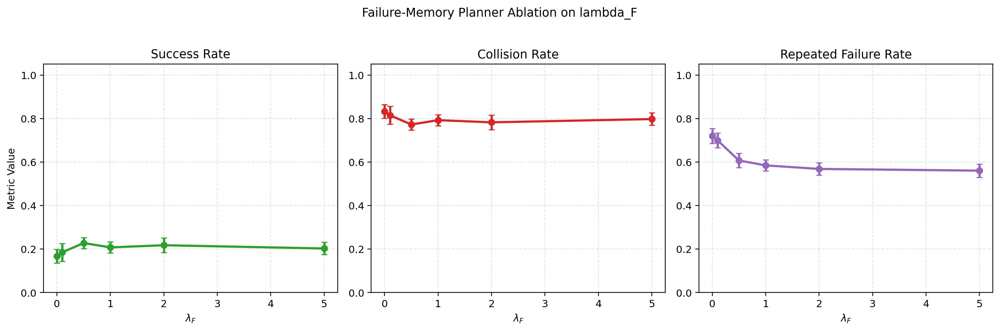

*Figure note.* The report should describe `lambda_F = 0.5` as the best value among the tested sweep values, not as a generally optimal setting. The differences are moderate, and the uncertainty bars overlap substantially.

### Candidate-Budget Sweep
| K | Success Rate | Collision Rate | Repeated Failure Rate | Inference Time |
| --- | --- | --- | --- | --- |
| 5 | 0.150 +- 0.060 | 0.850 +- 0.060 | 0.625 +- 0.055 | 1.144 ms +- 0.013 ms |
| 10 | 0.415 +- 0.073 | 0.585 +- 0.073 | 0.461 +- 0.081 | 1.238 ms +- 0.014 ms |
| 20 | 0.578 +- 0.025 | 0.422 +- 0.025 | 0.335 +- 0.020 | 1.457 ms +- 0.012 ms |
| 30 | 0.628 +- 0.014 | 0.372 +- 0.014 | 0.300 +- 0.019 | 1.687 ms +- 0.025 ms |
| 40 | 0.625 +- 0.020 | 0.375 +- 0.020 | 0.305 +- 0.015 | 1.911 ms +- 0.020 ms |

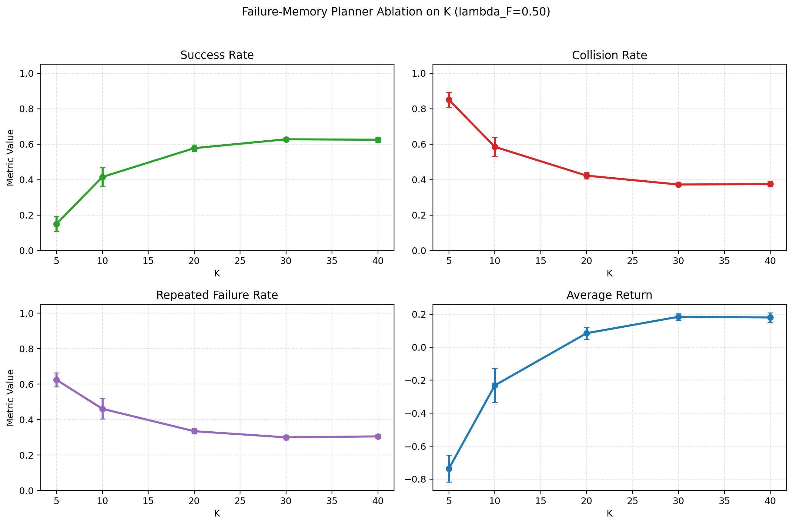

*Figure note.* Increasing `K` improves success and lowers collision and repeated-failure rate, but it also increases action-selection time from roughly `1.144 ms` at `K=5` to `1.911 ms` at `K=40`.

### Sweep Interpretation
The numeric sweeps support a more careful claim than the earlier draft:
- `lambda_F = 0.5` was the strongest setting in this exploratory sweep, but the report should not describe it as independently validated.
- Larger `K` improves robustness under the current generator, but the improvement from `K=30` to `K=40` is smaller than the jump from `K=10` to `K=20`, while the computational cost keeps rising.

## Limitations
1. The environment is small, deterministic, and fully observable.
2. The diffusion model is retrained separately for each seed and each map.
3. Training demonstrations come from BFS with full map knowledge.
4. Online scoring uses the exact simulator, so the diffusion-family planners are model-based at inference time.
5. Even with 10 seeds, statistical power remains moderate compared with a much larger experimental study.
6. The new ablation indicates that some earlier mechanism-level claims were too strong.

## Conclusion
The revised evidence supports a stronger and more honest report because it now answers the research questions directly.

1. Research Question 1 asked how a diffusion-based planner behaves in deterministic GridWorlds when trained on BFS demonstrations. The results show that standard diffusion planning is workable on simple maps but unreliable on deceptive geometry, where it frequently collapses into collision-heavy behavior driven by local goal-distance bias.
2. Research Question 2 asked whether online failure memory improves robustness without retraining the generator. The answer is yes. Relative to the original failure-memory planner, the improved planner consistently increased success on the deceptive and obstacle maps and collision dropped to zero across all 10 seeds on those two difficult maps.
3. Research Question 3 asked which components matter most. The new ablation shows that adaptive weighting is the most critical mechanism in the final design. Diversity and the loop penalty were not individually decisive under the current budget, and tail-only memory should be described as a cleaner credit-assignment choice rather than a universally stronger empirical variant.
4. Research Question 4 asked how `K` and `lambda_F` control the trade-off between robustness and cost. The sweeps show that `lambda_F = 0.5` was the strongest value among the tested settings in this study, while larger `K` improved success and reduced collision at the cost of slower action selection. The gain from increasing `K` is real but diminishing.

Taken together, these answers support a narrower but more defensible conclusion than the earlier draft. The project does not show that diffusion planning is the best general planner in small known GridWorlds. It does show that online failure-aware ranking can materially improve diffusion-based planning in deterministic environments, especially when adaptive weighting is used to counter misleading local goal-distance bias.
